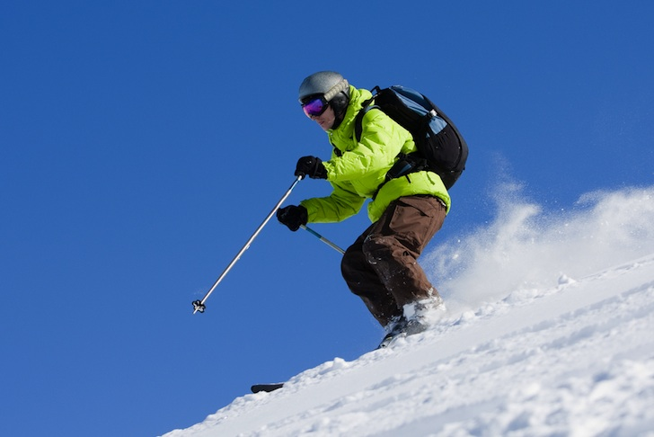

# Image Captioning Project

This project generates an English caption for a particular image. To extract the features of the image I have used pre-trained VGG16 model. I have used Tensorflow, Keras, LSTM(RNN) and CNN to develop the deep learning model which takes an image as input and generates caption for it. I have used NLP (with NLTK library) to clean the captions.

## Dataset
The dataset used for this project is Flickr8k Dataset.

## Performance
The model is trained on 6000 images. I have achieved a BLEU-1 = ~0.55 (with 1000 testing images) which is quite decent.

## Results

Image | Caption 
--- | --- 
 | **Caption generated**: black dog is running through the water
 | **Caption generated**: two men are playing soccer
 | **Caption generated**: skier is skiing down snowy hill
 | **Caption generated**: man in red shirt is riding on the beach
 | **Caption generated**: surfer is surfing wave
